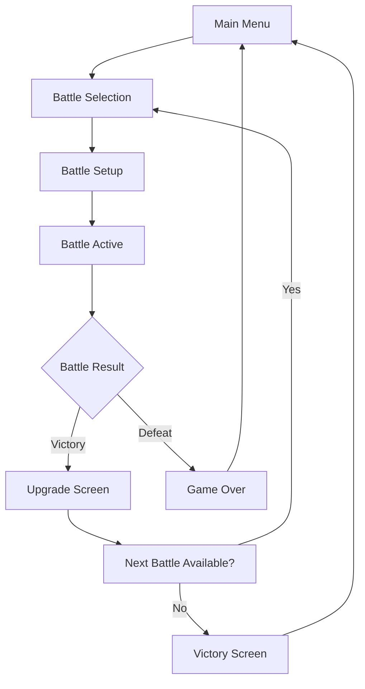

# Battle Arena Game Design Document

## Table of Contents

1. [Project Overview](#project-overview)
2. [Architecture and Folder Structure](#architecture-and-folder-structure)
3. [Core Battle System](#core-battle-system)
4. [UI Components](#ui-components)
5. [Game Flow](#game-flow)
6. [Testing & CI](#testing--ci)
7. [Build & Deployment](#build--deployment)
8. [Extensibility](#extensibility)

---

## Project Overview

A focused, turn-based battle arena game built with Phaser 3, featuring tactical grid-based combat. Players engage in strategic battles against various enemies on different battlefield maps, with emphasis on positioning, timing, and resource management.

**Core Features:**
- **Turn-based Combat**: Strategic battles with action point systems
- **Grid-based Movement**: Tactical positioning on varied battlefield layouts
- **Multiple Enemy Types**: Diverse opponents with unique behaviors and abilities
- **Battle Progression**: Advancing through increasingly challenging encounters
- **Skill System**: Character abilities and upgrades

**Tech Stack:**
- **Game Engine**: Phaser 3.90.0
- **Build Tool**: Vite 6.3.5
- **Testing**: Jest (unit) + Playwright (integration)
- **Language**: ES2024 modules
- **Deployment**: GitHub Pages

---

## Architecture and Folder Structure

```plaintext
/src
  /core
    /battle                # All battle-related game logic
      battleCore.js           # Main battle orchestrator
      battleEntities.js       # Player, enemies, items
      battleCombat.js         # Combat calculations and rules
      battleTurnManager.js    # Turn order and action processing
      battleTimeQueue.js      # Action scheduling by time cost
      battleAI.js            # Enemy AI behaviors
      battleMaps.js          # Battlefield layouts and generation
      battleProgression.js   # Level advancement and difficulty
      battleSkills.js        # Abilities and special actions
    /shared                # Shared utilities
      entities.js             # Base Entity class
      eventEmitter.js         # Event system
      gameState.js           # State management utilities
      constants.js           # Game constants and config
  /phaser
    /scenes
      battleScene.js          # Main battle scene
      menuScene.js           # Main menu and battle selection
      gameOverScene.js       # End game states
      upgradeScene.js        # Character progression between battles
    /ui
      /battle               # Battle-specific UI components
        battleHUD.js          # Health, AP, turn indicators
        actionMenu.js         # Available actions display
        directionButtons.js   # Movement controls
        turnLog.js           # Combat log
        skillsPanel.js       # Abilities interface
        enemyInfo.js         # Enemy status display
      /menu                # Menu UI components
        mainMenu.js          # Start screen
        battleSelect.js      # Battle selection interface
        settingsPanel.js     # Game options
    /assets
      /maps                # Battle map configurations
      /sprites             # Character and effect sprites
      /sounds              # Audio assets
    index.js              # Phaser config and initialization
/tests
  /core                   # Core logic tests
    battle.test.js
    turnManager.test.js
    ai.test.js
  /ui                     # Integration tests
    battle.spec.js
    menu.spec.js
  /ci                     # CI configuration
    jest.config.js
    playwright.config.js
```

---

## Core Battle System

### Battle Core Architecture

```javascript
// battleCore.js - Main orchestrator
class BattleCore {
  constructor(battleConfig) {
    this.emitter = new EventEmitter();
    this.turnManager = new BattleTurnManager();
    this.map = new BattleMap(battleConfig.mapData);
    this.entities = [];
    this.state = 'preparing'; // preparing, active, paused, ended
  }

  // Main battle loop
  processTurn() { /* ... */ }
  
  // Action handling
  executeAction(entity, action) { /* ... */ }
  
  // State management
  getCurrentState() { /* ... */ }
}
```

### Enhanced Entity System

```javascript
// battleEntities.js - Expanded entity definitions
class CombatEntity extends Entity {
  constructor(name, x, y, stats) {
    super(name, x, y, stats.hp);
    this.maxHp = stats.hp;
    this.actionPoints = stats.ap || 3;
    this.maxActionPoints = stats.ap || 3;
    this.skills = stats.skills || [];
    this.statusEffects = [];
    this.faction = stats.faction || 'neutral';
  }
}

class Player extends CombatEntity {
  constructor() {
    super('Hero', 0, 4, {
      hp: 30,
      ap: 4,
      attack: 3,
      defense: 2,
      skills: ['BasicAttack', 'Heal']
    });
  }
}

// Multiple enemy types
class Goblin extends CombatEntity { /* ... */ }
class Orc extends CombatEntity { /* ... */ }
class Wizard extends CombatEntity { /* ... */ }
```

### Turn Management System

```javascript
// battleTurnManager.js - Enhanced turn system
class BattleTurnManager {
  constructor() {
    this.turnQueue = [];
    this.currentTurn = 0;
    this.actionQueue = []; // For simultaneous actions
  }

  // Calculate turn order based on speed/initiative
  calculateTurnOrder(entities) { /* ... */ }
  
  // Process queued actions
  processActionQueue() { /* ... */ }
  
  // Handle action point system
  consumeActionPoints(entity, cost) { /* ... */ }
}
```

### Combat System

```javascript
// battleCombat.js - Comprehensive combat rules
class CombatSystem {
  static calculateDamage(attacker, defender, action) {
    const baseDamage = attacker.attack + action.power;
    const defense = defender.defense;
    const damage = Math.max(1, baseDamage - defense);
    return this.applyRandomness(damage);
  }

  static calculateHitChance(attacker, defender, action) { /* ... */ }
  static applyStatusEffect(target, effect) { /* ... */ }
  static processAreaOfEffect(action, targets) { /* ... */ }
}
```

### AI System

```javascript
// battleAI.js - Enemy artificial intelligence
class BattleAI {
  static calculateAction(enemy, battleState) {
    const strategy = this.getStrategy(enemy.type);
    return strategy.decide(enemy, battleState);
  }

  static strategies = {
    aggressive: new AggressiveStrategy(),
    defensive: new DefensiveStrategy(),
    support: new SupportStrategy()
  };
}
```

---

## UI Components

### Battle Scene

```javascript
// scenes/battleScene.js - Main battle interface
class BattleScene extends Phaser.Scene {
  create() {
    this.setupBattlefield();
    this.createUI();
    this.setupEventListeners();
    this.core.start();
  }

  setupBattlefield() {
    // Grid rendering
    // Entity sprites
    // Visual effects system
  }

  createUI() {
    this.battleHUD = new BattleHUD(this);
    this.actionMenu = new ActionMenu(this);
    this.turnLog = new TurnLog(this);
    this.skillsPanel = new SkillsPanel(this);
  }
}
```

### Enhanced UI Components

```javascript
// ui/battle/battleHUD.js - Comprehensive battle interface
class BattleHUD {
  constructor(scene) {
    this.scene = scene;
    this.createHealthBars();
    this.createActionPointIndicators();
    this.createTurnOrderDisplay();
    this.createMiniMap();
  }

  updatePlayerStats(player) { /* ... */ }
  updateEnemyStats(enemies) { /* ... */ }
  showDamageNumbers(entity, damage) { /* ... */ }
}

// ui/battle/actionMenu.js - Action selection interface
class ActionMenu {
  constructor(scene) {
    this.availableActions = [];
    this.selectedAction = null;
    this.targetingMode = false;
  }

  showActionsForEntity(entity) { /* ... */ }
  handleActionSelection(action) { /* ... */ }
  enterTargetingMode(action) { /* ... */ }
}
```

---

## Game Flow

### Battle Progression



### Battle States

1. **Preparation Phase**
   - Load battle map and entities
   - Initialize turn order
   - Display battle objectives

2. **Active Combat**
   - Process player actions
   - Execute AI turns
   - Handle combat resolution
   - Update game state

3. **Resolution Phase**
   - Calculate battle results
   - Award experience/loot
   - Transition to next state

### Scene Transitions

```javascript
// Game flow management
class GameFlowManager {
  static transitionToBattle(battleConfig) {
    scene.start('battle', battleConfig);
  }

  static battleComplete(result) {
    if (result.victory) {
      scene.start('upgrade', result);
    } else {
      scene.start('gameOver', result);
    }
  }
}
```

---

## Testing & CI

### Unit Testing Strategy

```javascript
// tests/core/battle.test.js
describe('BattleCore', () => {
  test('initializes with correct state', () => { /* ... */ });
  test('processes player moves correctly', () => { /* ... */ });
  test('handles combat resolution', () => { /* ... */ });
  test('manages turn order properly', () => { /* ... */ });
});

// tests/core/combat.test.js
describe('CombatSystem', () => {
  test('calculates damage correctly', () => { /* ... */ });
  test('applies status effects', () => { /* ... */ });
  test('handles area of effect attacks', () => { /* ... */ });
});
```

### Integration Testing

```javascript
// tests/ui/battle.spec.js
test('complete battle flow', async ({ page }) => {
  await page.goto(gameUrl);
  
  // Start battle
  await page.click('[data-testid="start-battle"]');
  await expect(page.locator('#battle-grid')).toBeVisible();
  
  // Execute actions
  await page.click('[data-testid="move-button"]');
  await page.click('[data-testid="attack-button"]');
  
  // Verify state changes
  await expect(page.locator('#turn-log')).toContainText('Attack successful');
});
```

### CI Configuration

```javascript
// tests/ci/jest.config.js
export default {
  testEnvironment: 'node',
  roots: ['<rootDir>/../core'],
  collectCoverageFrom: [
    'src/core/**/*.js',
    '!src/core/**/*.test.js'
  ],
  coverageThreshold: {
    global: {
      branches: 80,
      functions: 80,
      lines: 80,
      statements: 80
    }
  }
};
```

---

## Build & Deployment

### Vite Configuration

```javascript
// vite.config.js
export default defineConfig({
  base: '/battle-arena/',
  resolve: {
    alias: {
      '@core': path.resolve(__dirname, 'src/core'),
      '@phaser': path.resolve(__dirname, 'src/phaser'),
      '@shared': path.resolve(__dirname, 'src/core/shared'),
      '@assets': path.resolve(__dirname, 'src/phaser/assets')
    }
  },
  build: {
    outDir: 'dist',
    sourcemap: true,
    rollupOptions: {
      output: {
        manualChunks: {
          phaser: ['phaser'],
          core: ['src/core/battle/battleCore.js']
        }
      }
    }
  }
});
```

### Package Scripts

```json
{
  "scripts": {
    "dev": "vite",
    "build": "vite build",
    "preview": "vite preview",
    "test:core": "jest --config tests/ci/jest.config.js",
    "test:ui": "playwright test --config tests/ci/playwright.config.js",
    "test": "npm run test:core && npm run test:ui",
    "test:coverage": "jest --coverage",
    "predeploy": "npm run test && npm run build",
    "deploy": "gh-pages -d dist"
  }
}
```

---

## Extensibility

### Future Enhancements

1. **Battle Variety**
   - Multiple map types (forest, dungeon, arena)
   - Environmental hazards and interactive objects
   - Dynamic weather effects

2. **Character Progression**
   - Skill trees and ability unlocks
   - Equipment and inventory system
   - Character customization

3. **Advanced Combat**
   - Combo system for chained actions
   - Environmental interactions
   - Team-based battles with multiple allies

4. **Content Systems**
   - Battle editor for custom encounters
   - Procedurally generated battles
   - Challenge modes and tournaments

### Modular Design Benefits

- **Easy Testing**: Each system can be tested in isolation
- **Performance**: Core logic separated from rendering
- **Maintainability**: Clear separation of concerns
- **Extensibility**: New features can be added without affecting existing code

### Plugin Architecture

```javascript
// Plugin system for extending battles
class BattlePlugin {
  constructor(core) {
    this.core = core;
  }
  
  onBattleStart() { /* Override in subclasses */ }
  onTurnEnd() { /* Override in subclasses */ }
  onBattleEnd() { /* Override in subclasses */ }
}

// Example: Environmental effects plugin
class WeatherPlugin extends BattlePlugin {
  onTurnEnd() {
    this.applyWeatherEffects();
  }
}
```

This design maintains the modular architecture of the original repository while focusing entirely on creating a rich, engaging battle experience. The system is built to be extensible, testable, and maintainable while providing a solid foundation for a turn-based combat game.